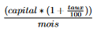

# DS  node express

## Mathieu Chedozeau
## Maxime Jougla
 
[Depot Github](https://github.com/Madianou/tp-ejs)

### Install

```bash
npm install
```

La commande installera les packages suivants : 
- express 
- express-session
- ejs
- body-parser


### Run server

```bash
npm run start
```

ou 
```bash
node ds/app.js
```
<<<<<<< HEAD
### Doc
=======
### Doc

#### Session

Pour gérer la connexion et les résultats du calcul des mensualités pour emprunt on utilise des variables de session.

```javascript
router.post('/login', (req, res, next) => {
    const param1 = req.body.username;
    const param2 = req.body.password;
    console.log("login = "+param1+" mdp = "+param2);
    if (param1 == "user" && param2 == "user"){
        req.session.isLogin = true;
        req.session.mensualités = mensualités;
        res.redirect('/');
    }
    else{
        res.redirect('/login');
    }

});
```

La variable ```isLogin``` permet de vérifier si l'utilisateur est connecté ( comme on utilise pas de base de données on vérifie seulement si les identifiants renseignés sont user et user ). On utilisera cette variable pour afficher dans le header les bons boutons (Login si il n'est pas connecté ou Logout si il est connecté).

Exemple avec la page 404 :

```javascript
app.use((req,res,next)=>{
    if(req.session.isLogin) {
        res.status(404).render(path.join(__dirname, "views", "404.ejs"), {pageTitle: "404 not Found", connect : "connecté"});
    }
    else{
        res.status(404).render(path.join(__dirname, "views", "404.ejs"), {pageTitle: "404 not Found", connect : "non connecté"});
    }
});
```


La variable ```mensualités``` est un tableau vide pour l'instant qui sera remplie avec les futurs calculs de mensualités d'emprunt.

Dans la page du formulaire de calcul d'emprunt on ajoute les résultats du calcul dans la variable de session.

```javascript
req.session.mensualités.push({ message: [req.body.capital,req.body.taux,mois,mensualite]});
```

Quand on se déconnecte on va venir vider les variables de sessions dans le fichiers logout.js, ainsi après une reconnexion sans relancer l'application on ne retrouvera pas les calculs de la précédente session.

```javascript
const path = require('path');
const express = require('express');
const router = express.Router();


router.get("/logout",(req,res,next)=>{
    req.session.isLogin=false;
    req.session.userName = "";
    req.session.message = [];
    res.redirect('/');
});

exports.routes = router;
```


#### Calcul d'emprunts

```javascript
router.post('/form', (req, res, next) => {
    console.log(Object.assign({},req.body));

    if (req.body.mois == ""){
        var mois = 12;
    }
    else{
        var mois = req.body.mois;
    }

    const mensualite = (req.body.capital*(1+req.body.taux/100))/mois;
    
    req.session.message.push({ message: [req.body.capital,req.body.taux,mois,mensualite]});
    res.redirect('/form');
});
```

Ici, le calcul d'emprunt se fait dans le middleware form.js. L'utilisateur entre 3 données pour effectuer son calcul de mensualité.
On retrouve :
- le capital
- le taux
- le nombre de mois

Pour calculer la mensualité, on utilise la formule suivant :



Le calcul se fait directement dans la variable mensualité.
Cette même variable est ajoutée dans un tableau _message_ qui est dans la session de l'utilisateur. Comme dit dans la partie session, l'objectif, ici, est de vider
le contenu du tableau message lors de la déconnexion.

Après avoir obtenu notre résultat, l'utilisateur est renvoyé de nouveau vers la page emprunt avec cette fois ci la liste des calcul effectués.

L'affichage se fait sous forme de table avec la structure :

| Capital   |  Taux  | Mois | Mensualité |
|-----------|:------:|-----:|-----------:|
| capital 1 | taux 1 |    n |      XXX e |
| capital 2 | taux 2 |    n |      XXX e |
| capital 3 | taux 3 |    n |      XXX e |


#### Bonus

Rendez-vous sur la page jeu et franchissez les paliers suivant :
- Facile : 10 pts
- Moyen : 15 pts
- Difficile : 20 pts
- Impossible : 30 pts
